# NewAPI Model Canonicalizer 使用指南

本文档说明脚本的使用流程与常见问题。规则细节与实现说明见 `userscript/README.md`。

---

## 1. 功能概述

脚本用于把渠道中的模型别名归一到统一的 canonical key，并生成/更新渠道 `model_mapping`：

- key：canonical（标准模型名）
- value：渠道中真实存在的模型名（actual）

主要约束：

- 同系列、同版本、同 tier（可选 mode/批次）才会归并
- value 必须存在于该渠道 `models` 列表
- 禁止互映与回环

互映与回环示例：

错误示例（互映）：

```json
{
  "gpt-4.1": "gpt-4.1-mini",
  "gpt-4.1-mini": "gpt-4.1"
}
```

错误示例（回环）：

```json
{
  "a": "b",
  "b": "c",
  "c": "a"
}
```

正确示例（单向映射到实际模型名）：

```json
{
  "gpt-4.1": "openai/gpt-4.1-2025-xx-xx",
  "gpt-4.1-mini": "openai/gpt-4.1-mini-2025-xx-xx"
}
```

示例：

```json
{
  "claude-4.5-sonnet": "anthropic/claude-sonnet-4.5"
}
```

---

## 2. 安装与前置条件

### 2.1 安装脚本

1. 安装 Tampermonkey（或兼容 Userscript 扩展）
2. 直接打开脚本安装链接（兼容扩展通常会自动识别并弹出安装）：[newapi-model-canonicalizer.user.js](https://github.com/Dawn6666666/newapi-model-canonicalizer/raw/refs/heads/main/userscript/newapi-model-canonicalizer.user.js)
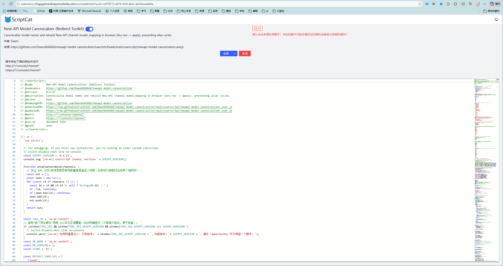

3. 备选：从仓库本地安装 [`userscript/newapi-model-canonicalizer.user.js`](https://github.com/Dawn6666666/newapi-model-canonicalizer/blob/main/userscript/newapi-model-canonicalizer.user.js)


### 2.2 登录 New-API 控制台

脚本依赖当前浏览器登录态（cookie + localStorage 中的用户信息）。

访问：

- `http(s)://<你的NewAPI域名>/console/channel`

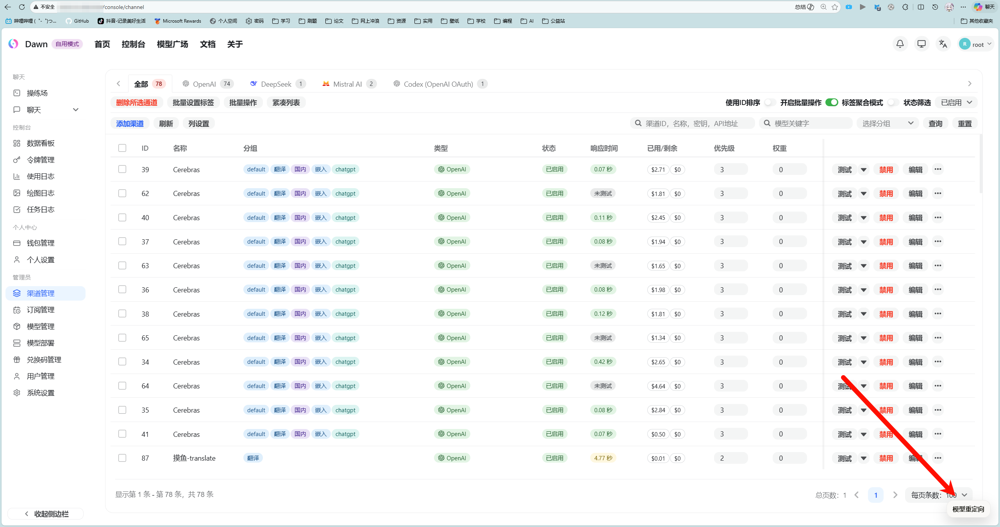

---

## 3. 使用流程

默认路径是“全量渠道处理”：刷新全量快照后，直接 dry-run 全部渠道，并按审阅结果批量写入。

### Step A：刷新全量渠道

在 `/console/channel` 页面右下角打开 `模型重定向` 浮窗，点击 `刷新全量渠道`。

作用：

- 拉取渠道列表
- 解析并缓存 `models` 与 `model_mapping`（IndexedDB）

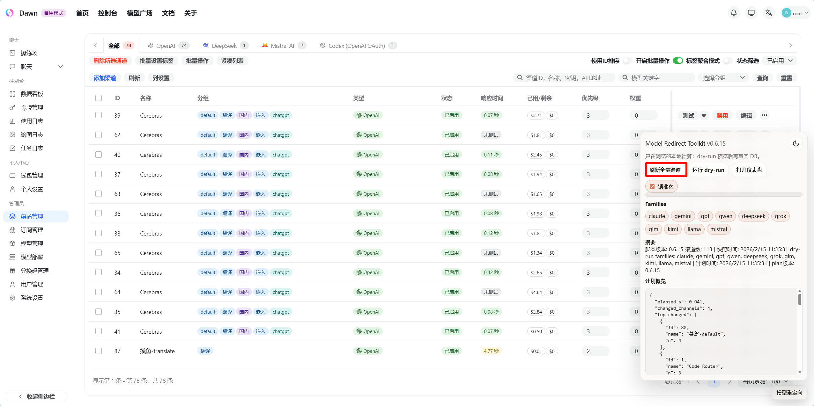

### Step B：选择家族与 pinned（可选）

- `Families`：选择参与归一化的家族
- `锁批次（pinned）`：是否额外生成 `base-buildTag` key

示例（关闭 pinned）：

```json
{
  "deepseek-r1": "deepseek-ai/deepseek-r1-0528"
}
```

示例（开启 pinned）：

```json
{
  "deepseek-r1": "deepseek-ai/deepseek-r1-0528",
  "deepseek-r1-0528": "deepseek-ai/deepseek-r1-0528"
}
```

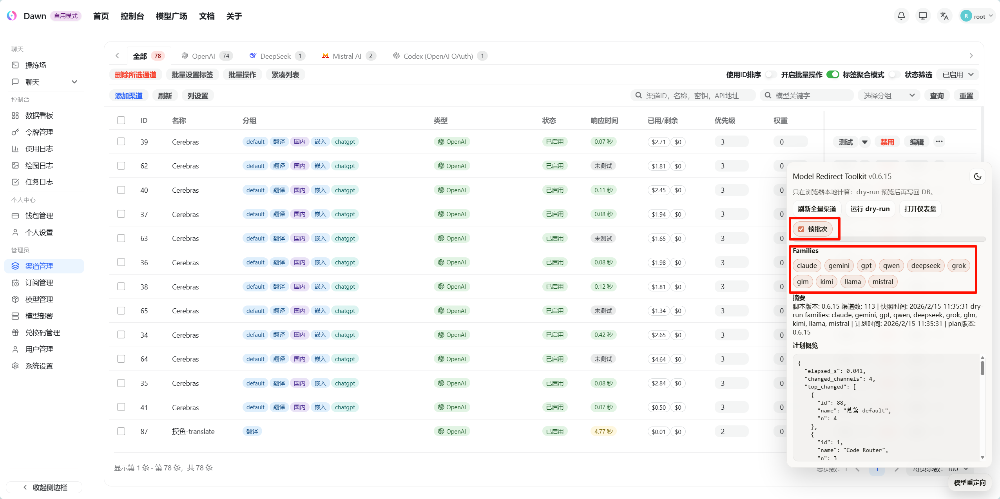

### Step C：运行 dry-run

点击 `运行 dry-run`，仅计算不写库。

补充：

- 在小浮窗运行 dry-run：按当前 Families 选择计算。
- 在仪表盘运行 dry-run（`v0.6.16` 起）：如果顶部 family tab 不是 `all`，只计算该家族；`all` 时计算全家族。

输出包括：

- 每渠道的 Diff（新增/删除/变更）
- 计划写入后的 mapping（Plan）
- 风险与告警

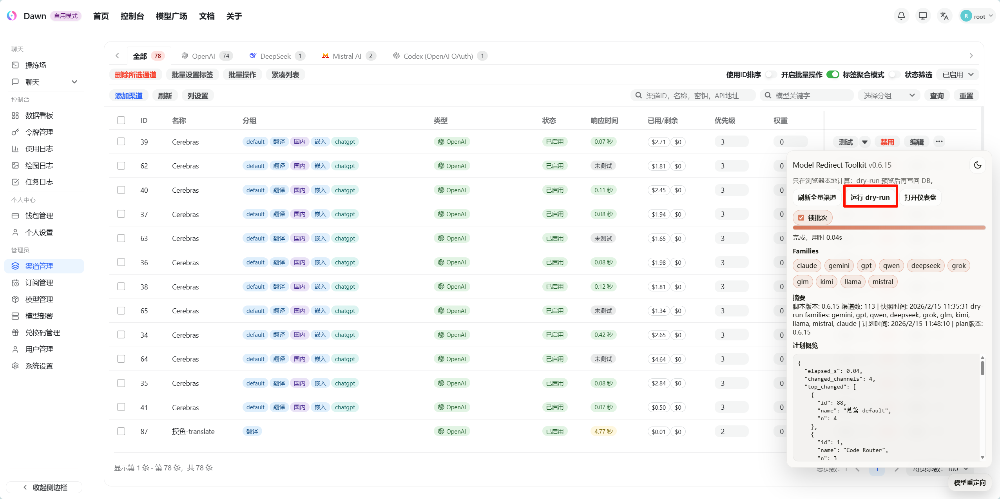

### Step D：在仪表盘审阅

点击 `打开仪表盘`，主要区域：

1. 左侧：渠道列表与筛选
2. 中间：`Diff / Plan / DB` 三种视图
3. 右侧：写入、存档点、回滚、JSON 预览

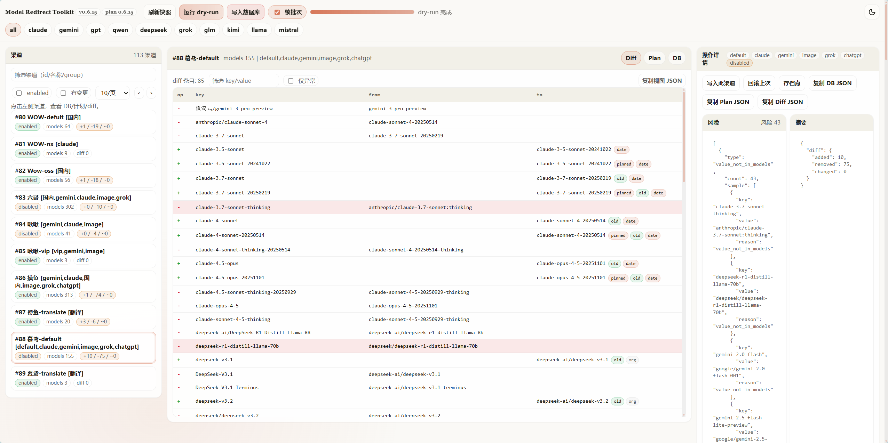

### Step E：写入数据库

写入方式：

- `写入数据库`：批量写入所有有变更渠道（默认）
- `写入此渠道`：仅当前渠道（排查或灰度时使用）

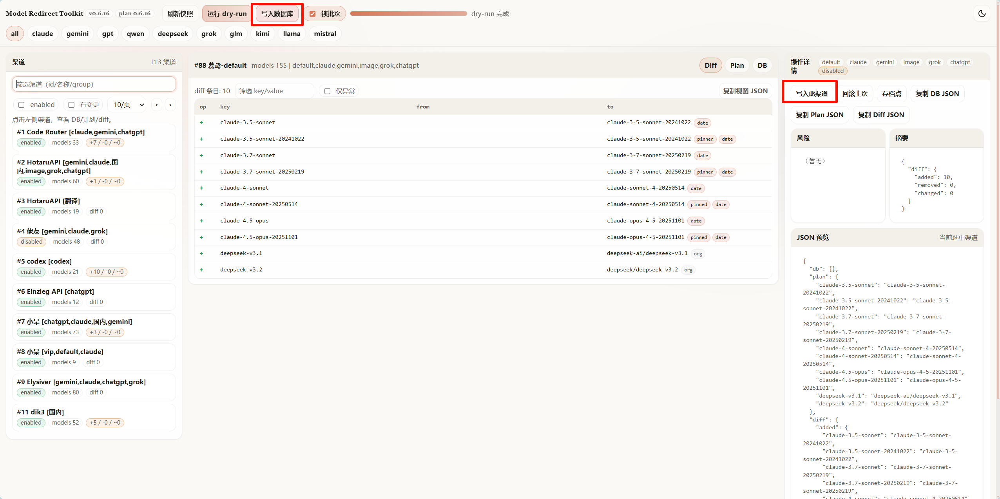

---

## 4. 输入与输出示例

示例 1（同模型不同写法归并）：

渠道 `models`：

```text
anthropic/claude-sonnet-4.5, claude-sonnet-4-5, claude-4.5-sonnet
```

生成的 `model_mapping`（示例）：

```json
{
  "claude-4.5-sonnet": "anthropic/claude-sonnet-4.5"
}
```

示例 2（含 wrapper/route 的输入）：

渠道 `models`：

```text
google/gemini-2.5-pro, Gemini-2.5-Pro, image/gpt-image-1, openrouter/free
```

生成的 `model_mapping`（示例）：

```json
{
  "gemini-2.5-pro": "google/gemini-2.5-pro"
}
```

说明：`image/gpt-image-1` 与 `openrouter/free` 通常不进入标准重定向。

示例 2.1（已经有同名 canonical，不会新增映射）：

渠道 `models`：

```text
gpt-5, gpt-5-codex, qwen-3-32b
```

生成的 `model_mapping`（示例）：

```json
{}
```

说明：这些名字本身已可直接作为 canonical 调用，通常不会再写 `key == value` 的冗余映射。

示例 3（pinned 开关对比）：

关闭 pinned：

```json
{
  "deepseek-r1": "deepseek-ai/deepseek-r1-0528"
}
```

开启 pinned：

```json
{
  "deepseek-r1": "deepseek-ai/deepseek-r1-0528",
  "deepseek-r1-0528": "deepseek-ai/deepseek-r1-0528"
}
```

---

## 5. 视图说明

### 5.1 Diff

字段：

- `op`：`+` 新增，`-` 删除，`~` 变更
- `key`：canonical key
- `from`：写入前 value
- `to`：计划写入 value

判读示例：

```text
+  claude-4.5-sonnet   -> anthropic/claude-sonnet-4.5
~  gpt-4.1             openai/gpt-4.1 -> openai/gpt-4.1-2025-xx-xx
-  qwen-3-32b          -> (removed)
```

含义：

- `+`：新增标准入口
- `~`：同 key 的 value 更新
- `-`：旧条目被移除（通常不再满足规则）

### 5.2 Plan

展示本次 dry-run 计算出的完整写入结果（`after mapping`）。

### 5.3 DB

展示数据库当前 `model_mapping`。

---

## 6. 异常与风险

常见异常：

- `value_not_in_models`：计划写入的 value 不在该渠道 `models` 中

处理方式：

1. 先同步/更新渠道 `models`，再 dry-run
2. 调整家族选择或范围，重新计算

---

## 7. 写入前检查清单

```text
[ ] 已刷新全量渠道快照
[ ] 已完成 dry-run（全渠道）
[ ] 已检查“仅异常”列表
[ ] 已确认无无法解释的删除/变更
[ ] 已确认 pinned 开关符合预期
[ ] 准备执行“写入数据库”
```

---

## 8. 存档点与回滚

写入前脚本会创建存档点，记录：

- `before`：写入前 mapping
- `after`：计划写入 mapping
- `diff`：差异统计

回滚方式：

1. `回滚上次`：回滚最近一次写入对应存档点
2. `存档点`：从列表选择任意存档点回滚

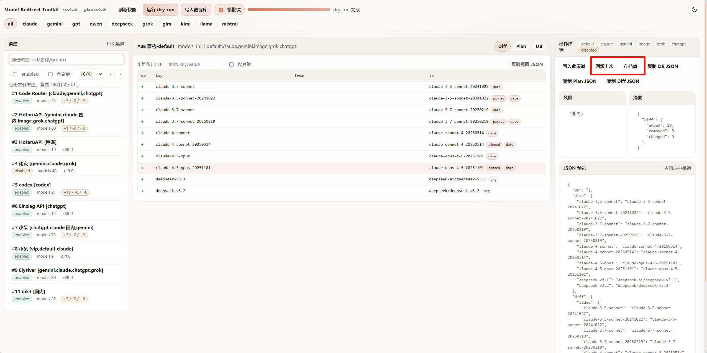
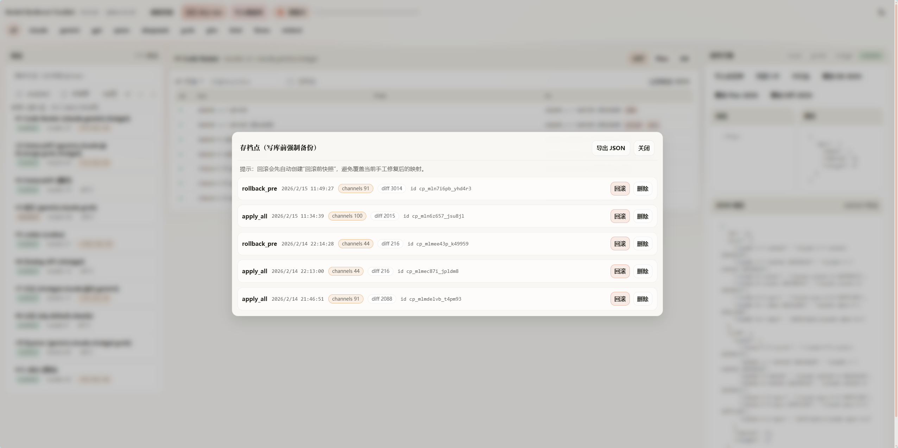


说明：

- 为减少请求压力，`before` 默认使用快照中的 DB 值。写入前刷新快照可降低偏差。

---

## 9. 常见误区

1. 误区：`value` 可以写成任意模型名。
实际：`value` 需要存在于该渠道 `models` 中。
2. 误区：出现红色异常也可以直接批量写入。
实际：红色异常通常表示命中风险，建议先处理。
3. 误区：`image/`、`embedding/`、route/tag 会自动归并到标准模型。
实际：这类名称通常被排除在重定向之外。
4. 误区：开启 pinned 会替代基础 key。
实际：pinned 是附加 key，不会替代 base key。
5. 误区：dry-run 结果长期有效。
实际：渠道模型变化后需要重新刷新快照并重跑 dry-run。

---

## 10. 规则速览

以下内容基于规则文档与样例整理，用于快速判断映射生成与排除条件：

1. canonical key 形态约束  
canonical 只允许小写字母、数字、`.`、`-`，并且不能包含 `/`。  
示例：`claude-4.5-sonnet`、`deepseek-r1-0528`。

补充：

- canonical 需要符合正则：`^[a-z0-9][a-z0-9.-]*[a-z0-9]$`
- canonical 需要以家族前缀开头（如 `claude-`、`gemini-`、`qwen-`）
- gpt 家族允许 `gpt-` 以及 `o1/o3/o4` 前缀

2. 不参与重定向的常见类型  
- route/tag：`openrouter/free`、`switchpoint/router`  
- pointer 别名：`*-latest/*-default/*-stable/*-current`  
- hard wrapper：`image/`、`embedding/`、`stream/`、`假流式/`  
- 专项模型：`tts/asr/stt/transcription/embed/rerank/moderation/image-generation/video-generation`  
- 用途/限额标注：如 `[...]` 内含渠道、上限、翻译等说明

3. mode 与 wrapper 的区别  
- `thinking/`、`reasoning/`、`high/medium/low/` 属于 mode wrapper：会剥离前缀并保留 mode 到 canonical。  
- `image/`、`embedding/` 等 hard wrapper：通常直接排除，不进通用重定向。

4. pinned key 的批次来源  
- Claude/Gemini/GPT：更偏向 8 位日期批次（如 `20250929`）  
- Qwen/DeepSeek/GLM/Kimi 等：更偏向 4 位批次（如 `2507/0528/0414/0905`）

5. 写入时 value 复用规则  
- 默认：同一渠道内，同一个 actual value 只会分配给一个 base key（避免多 key 争抢同一 value）。  
- 例外：pinned key 可以与 base key 复用同一个 actual value。

---

## 11. FAQ

### Q1：写入出现 429 Too Many Requests

New-API 管理端触发限流。可改为单渠道写入、降低并发写入频率，或稍后重试。

处理示例：

- 现象：批量写入中途报 429。
- 原因：管理端限流。
- 处理：等待后重试；必要时先按家族分批写入。

补充：

- 脚本会自动重试：网络异常、`429`、`5xx`
- 脚本不会自动重试：`400/401/403` 和业务层失败（`success=false`）
- 若接口返回非 JSON（例如网关错误页），会直接报错“响应非 JSON”

### Q2：写入出现 401/403

处理示例：

- 现象：写入请求返回未授权/无权限。
- 原因：当前登录账号缺少渠道更新权限，或登录态失效。
- 处理：重新登录并确认账号权限后重试。

### Q3：为什么某些模型没有进入计划

常见原因：

- 命中 route/tag 或 wrapper 规则（如 `image/xxx`）
- 属于专项用途或标注模型，被排除
- 在该渠道中没有可用候选 actual
- 名称是 `*-latest/*-default/*-stable/*-current` 指针别名，默认不作为候选
- 渠道里已存在同名 canonical，本次不会新增映射

### Q4：dry-run 后提示计划可能过期

处理示例：

- 现象：仪表盘提示计划与快照/脚本版本不一致。
- 原因：快照已变化或脚本已更新。
- 处理：重新刷新全量渠道并重跑 dry-run。

### Q5：`image/xxx`、`翻译`、`[输出上限]` 这类模型怎么用

这类模型通常不参与重定向，直接使用完整模型名调用。

---

## 12. 使用案例截图（实际运行）

### 12.1 仪表盘示例

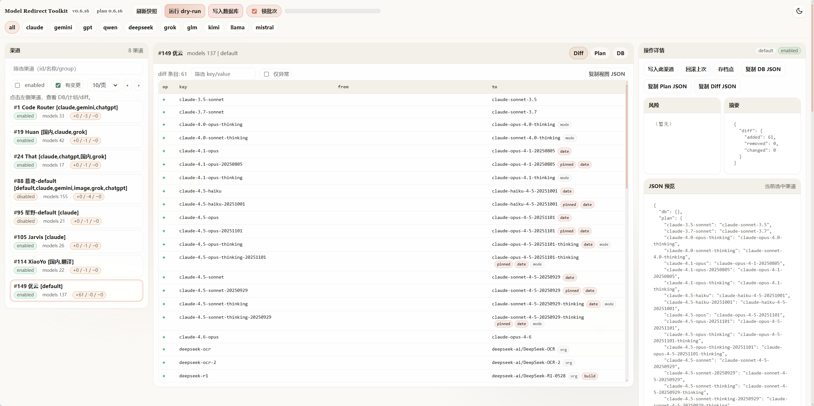
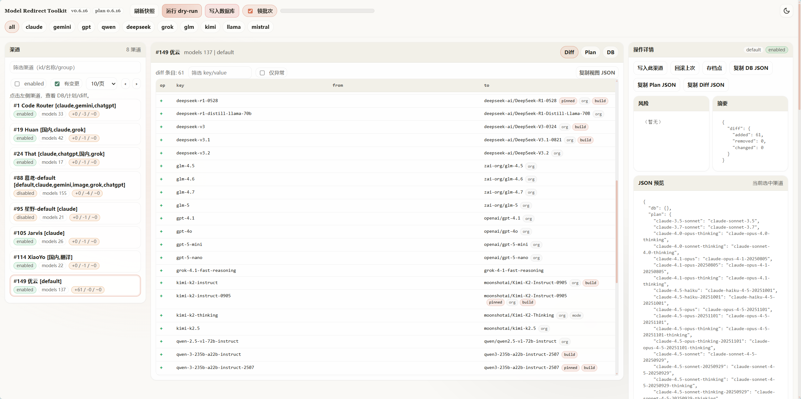
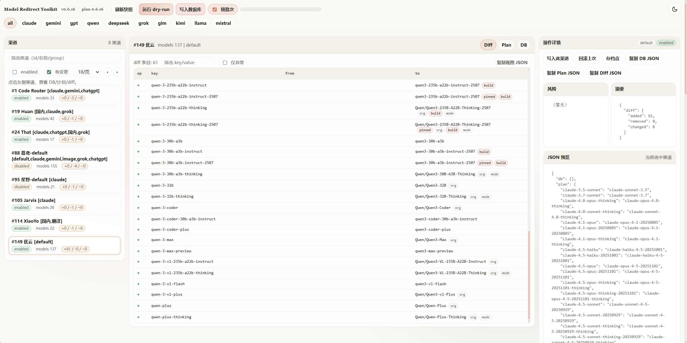

### 12.2 渠道编辑页映射示例

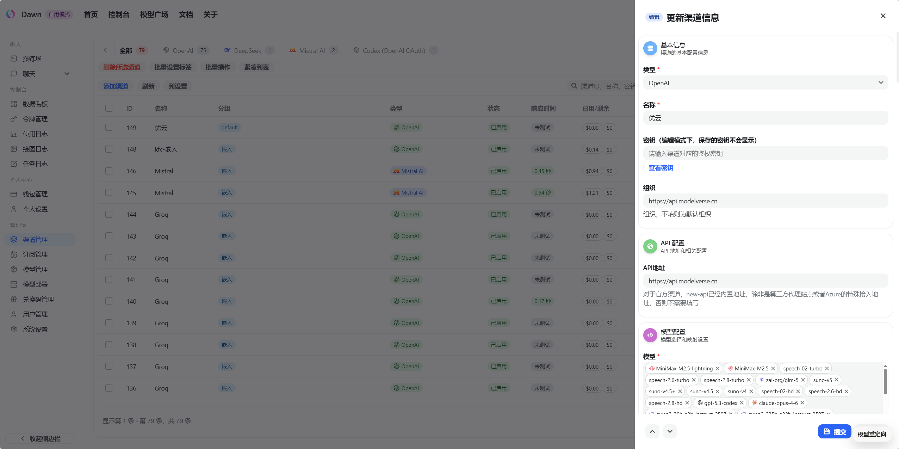
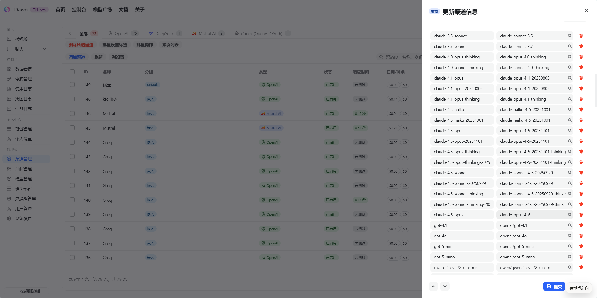
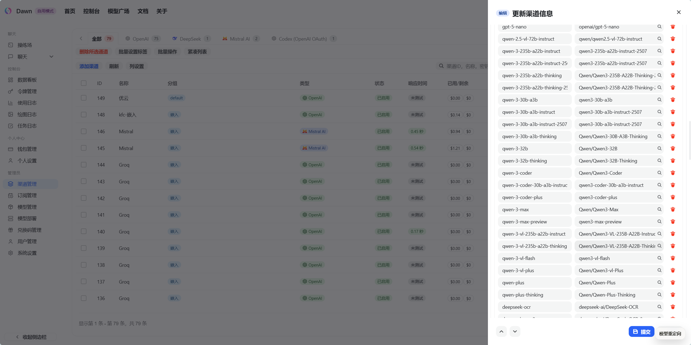
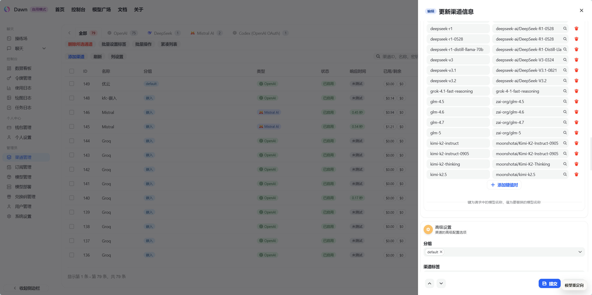

